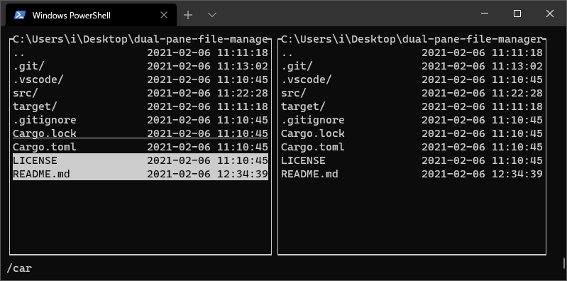

# dual-pane-file-manager



Rustの勉強がてら作るTUI2画面ファイラ

srcウィンドウとdestウィンドウの2画面
srcウィンドウが操作対象

## Usage

- `q` 終了する
- `j` カーソルを下に移動する
- `k` カーソルを上に移動する
- `h` 親ディレクトリに移動する
- `l` 子ディレクトリに移動する
- `g` カーソルを一番上に移動する
- `G` カーソルを一番下に移動する
- `/` ディレクトリ内の名前検索
- `Tab` srcウィンドウを切り替える
- `o` srcディレクトリをdestディレクトリと同じにする
- ` ` マークを付ける/外す
- `Enter` 実行する (*)
- `e` 編集する (*)
- `c` コピー
- `m` 移動
- `d` 削除
- `i` ディレクトリ作成
- `b` ブックマーク

*: 設定ファイルで指定する。

## Customize

`~/.config/dual-pane-file-manager/settings.json` が設定ファイル。
実行・編集に何を使うかを設定する。`%p` がファイルパスに変換される。
ブックマークのパスリストを設定する。

```
{
    "exec_command": {
        "program": "explorer",
        "args": "%p"
    },
    "edit_command": {
        "program": "gvim",
        "args": "%p"
    },
    "bookmarks": [
        "C:\\Users\\i"
    ]
}
```

CUIなやつは `tmux new-window vim %p` とかにしておけばいいんじゃないのかな…
